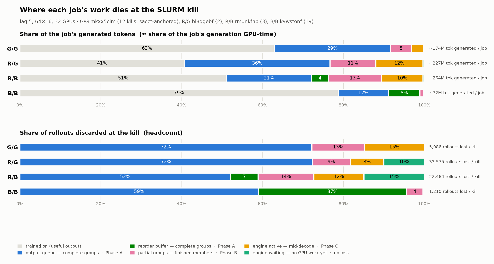

# Durable Rollout Bank: Persisting RL Rollout State Across 4h SLURM Kills

*Author: Laura Dang · July 2026 · Status: Draft for team review*

---

## 1. Background / Goal

### Background

The rollout-granularity work (PRs to Megatron-LM `main`; example run:
[wandb lxi2fprk](https://wandb.ai/adlr/megatron-rl/runs/lxi2fprk?nw=nwuserlaurad))
lets us run GRPO with five submission/consumption settings — B/B, G/G, G/B, R/B,
R/G — instead of only the original B/B. The point of the non-B/B modes is to fill
trainer GPU idle bubbles by generating rollouts ahead of consumption and banking
them in queues, bounded by the `--rl-generation-lag` run-ahead cap. With the recent
consumption-release fix (`0242f8de9`, `9421e8fcd`), the banked backlog is bounded by
gate capacity = `(lag + 1)` batches (`get_rl_parallel_generation_tasks`,
`rollout_granularity.py:11-18`), i.e. `(lag+1) × prompts_per_step × group_size`
rollouts. With the math-env launch config (`nanov3_rl.sh`: 64 prompts, group 16),
a lag-5 run banks up to (5+1) × 64 × 16 = **6,144 rollouts of work** in steady
state.

The problem: our cluster kills every job at the 4h SLURM wall-clock limit, and
**all banked state lives in rank-0 process memory**:

- completed-but-unconsumed rollout groups (`output_queue`, the B-consume reorder
  buffer, the `WeightedMultiTask` round queue),
- partially assembled groups (`assemble_queue`),
- in-flight inference requests (KV cache + tokens generated so far),
- in-flight NemoGym episodes (mid-conversation, mid-tool-call).

On restart, `buffered_rollouts = None` (`megatron/training/training.py:3631`)
forces `get_grpo_data_iterator` to regenerate everything from scratch
(`rl_utils.py:1813-1821`). Every 4h we forfeit exactly the surplus the granularity
modes exist to build — a major reason R/G submission currently loses to B/B in
wall-clock experiments despite better bubble utilization.

### Measured cost of the status quo

**Headline: kills destroy 15–60% of each job's generated tokens — the more
run-ahead a mode leaves unconsumed, the more each kill burns — and the tax
repeats every restart.**

| Mode | Trained on | Discarded at kill | Waste per kill |
|---|---|---|---|
| [R/G `bl8qgebf`](https://wandb.ai/adlr/megatron-rl/runs/bl8qgebf) | 40% | ~60% | ~134M tok ≈ 42–64 GPU-h |
| [R/B `rmunkfhb`](https://wandb.ai/adlr/megatron-rl/runs/rmunkfhb) | ~55% | ~45% | ~124M tok ≈ 24–36 GPU-h |
| [G/G `mkxx5cim`](https://wandb.ai/adlr/megatron-rl/runs/mkxx5cim) | ~63% | ~37% | ~64M tok ≈ 20–31 GPU-h |
| [B/B `k9wstonf`](https://wandb.ai/adlr/megatron-rl/runs/k9wstonf) | ~79% | ~15–21% | ~15M tok ≈ 5–7 GPU-h |

- **Waste tracks how open-loop the gate is, in both share and absolute terms**
  (R/G > R/B > G/G > B/B). R-submission slots release at *inference*
  completion, so R banks grow unbounded across a 4h job (22–34k rollouts by
  kill time). G/G's slots release at *consumption*, capping its bank at one
  gate population — every G/G kill destroys ~5,986 rollouts (4,319 banked +
  ~781 partial members + ~887 mid-decode) but never more; sacct independently
  confirms ~6,144 discarded per kill. B/B's small queues (~73 groups) are
  exactly why it wins wall-clock today. The bank removes that trade.
- **G/G's run also burned ~120 GPU-h on 14 startup-failure jobs** (Ray version
  mismatch; gym never started, zero rollouts) — real allocation waste, but a
  separate failure class the bank does not address.
- R-mode waste is 24–64 GPU-h of each 128 GPU-h allocation, per kill.
- The tax repeats every job: each restart rebuilds the queues from zero (the
  first post-restart step already shows ~55–140M tokens refilled), and the next
  kill destroys them again.

**Runs:** 2026-07-17 `lagshape_nvls32ap`, 8 nodes / 32 GPUs, 64 prompts ×
group 16, lag 5, gate = 6,144 (kills analyzed — G/G: 12 mid-generation kills
per sacct: 11× 4h TIMEOUT + 1 NVLink + 1 scancel; R/G: 2, R/B: 3, B/B: 19).

**Method:** R rows — per-env `*_pipeline_*` queue/gate snapshots at each SLURM
segment's last logged step (kill boundaries from `_timestamp` gaps),
cross-checked against `inferred_count − yielded_count` token flow (agrees
within 1–4 points); engine split from the `rl_log_inference_batch_trace`
per-rank JSONLs (active/waiting counts + KV footprint at every suspend).
G/G and B/B rows — flow accounting over the same per-env pipeline counters from
the full W&B parquet history, with kill snapshots at counter resets;
engine-active approximated as `prepared − inferred` capped at the 2,784-slot
budget, tokens via the run-wide median trajectory length (~11.6–12k) — no
engine JSONLs, so their engine split is approximate. Two G/G corrections from
the sacct job table: the pipeline counters also reset *within* a job (~every
collection), so G/G's per-job generation denominator is anchored on sacct
(12 mid-generation kills, 120 iterations ⇒ ~9,400 trained rollouts/job) rather
than per-segment counters; and its 14 Ray-mismatch startup failures produced
zero rollouts (no engine ever ran) and are excluded. B/B's denominator is
W&B-derived, so its waste share is an upper bound. The full G/G + B/B extraction is committed as
[`rollout_bank_design_assets/bank_kill_waste_extract.py`](rollout_bank_design_assets/bank_kill_waste_extract.py)
— runnable against W&B alone, reproduces those table rows end to end.



*Top: share of each job's generated tokens (≈ generation GPU-time) — gray is
trained on, colors are destroyed at the kill, keyed to the phase that recovers
them. Bottom: the same loss by rollout headcount. Plot source:
`rollout_bank_design_assets/bank_kill_waste.py`.*

Where the destroyed work sits, per kill (averaged over kills; counts vs tokens
diverge because queue composition skews by env trajectory length):

| Where the work died | Recovered by | [G/G](https://wandb.ai/adlr/megatron-rl/runs/mkxx5cim) rollouts (% of lost) | [G/G](https://wandb.ai/adlr/megatron-rl/runs/mkxx5cim) tokens (% of gen) | [R/G](https://wandb.ai/adlr/megatron-rl/runs/bl8qgebf) rollouts (% of lost) | [R/G](https://wandb.ai/adlr/megatron-rl/runs/bl8qgebf) tokens (% of gen) | [R/B](https://wandb.ai/adlr/megatron-rl/runs/rmunkfhb) rollouts (% of lost) | [R/B](https://wandb.ai/adlr/megatron-rl/runs/rmunkfhb) tokens (% of gen) | [B/B](https://wandb.ai/adlr/megatron-rl/runs/k9wstonf) rollouts (% of lost) | [B/B](https://wandb.ai/adlr/megatron-rl/runs/k9wstonf) tokens (% of gen) |
|---|---|---|---|---|---|---|---|---|---|
| Complete groups in `output_queue` | **Phase A** (ledger ① / seed ④) | 4,319 (72%) | 50.3M (**28.8%**) | 24,272 (72%) | 81.8M (**36.0%**) | 11,696 (52%) | 53.9M (**21.0%**) | 714 (59%) | 8.9M (**12.5%**) |
| Complete groups in B-consume reorder buffer | **Phase A** | 0 | 0 | 0 | 0 | 1,531 (7%) | 10.9M (**4.2%**) | 443 (37%) | 5.5M (**7.7%**) |
| Finished members of partial groups (`_assemble_pending`) | **Phase B** (quiesce snapshot ③/⑤) | ~781 (13%) | 9.1M (**5.2%**) | ~3,164 (9%) | 25.5M (**11.3%**) | ~3,099 (14%) | 33.1M (**13.1%**) | ~50 (4%) | 0.6M (**0.9%**) |
| Mid-decode in the engine (active; 2,784 = 4 × 696 slot cap) | **Phase C** (token-level resume) | ~887 (15%) | 5.2M (**3.0%**) | 2,784 (8%) | 26.3M (**11.7%**) | 2,784 (12%) | 26.1M (**10.3%**) | ~3 (0%) | ~0 (**~0%**) |
| In engine waiting queue (submitted, never scheduled) | nothing to recover — skip-walk ⑥ re-serves | ~0 (0%) | ~0 (**~0%**) | 3,355 (10%) | ~0 (**~0%**) | 3,355 (15%) | ~0 (**~0%**) | 0 | 0 |
| **Total per kill** | | **5,986** | **~64M (~37%)** | **33,575** | **~134M (~59%)** | **22,464** | **~124M (~48%)** | **1,210** | **~15M (~21%)** |

(Measurement caveats: partial groups assume half-filled buckets; for the R rows,
engine-active tokens are the measured KV footprint at kill, ~101–104k blocks ×
256, which includes prompt tokens, so its generated-token share is slightly
overstated; G/G and B/B engine columns use the flow-accounting approximation
from the Method note; totals differ 1–4 points between snapshot- and flow-based
accounting.)

### Goal

Persist banked rollout work across job kills so a restart resumes with the bank
intact, at three levels of ambition:

1. **Completed groups** — never lose a finished-but-unconsumed group.
2. **Finished-but-ungrouped rollouts** — members of partially assembled groups.
3. **Token-level in-flight resume** — continue interrupted generations from their
   tokens-so-far instead of regenerating from token 0.

---

## 2. High-Level Design

### Architecture

The bank is a rank-0 sidecar with two write paths (write-through ledger,
per-window quiesce snapshot) and one read path (restore at startup). Three terms
used throughout:

- **Ledger** — an append-only history. Entries are never edited or deleted; a
  kill mid-write can only damage the final record (caught by a checksum), and a
  recorded event can be "undone" by ignoring it (how consumption rollback works).
- **Write-through** — data hits disk the moment it is created in memory, so a
  kill can never take back completed work.
- **Snapshot** — a point-in-time copy that atomically replaces its predecessor.
  Used for state that changes too fast to write through; loses whatever happened
  after the last copy.


**How to read the diagram.**

- Yellow box = the rank-0 training process. Everything inside is Python/GPU
  memory and vanishes at the 4h kill.
- Green box = a directory on Lustre. Everything inside survives.
- Rectangles = pipeline stages, ovals = queues, cylinders = files. Rollouts flow
  left to right.
- Solid arrows into the green box = writes, continuous **during the run**.
  Dashed blue arrows out of it = reads, once **at restart**.
- Goal tags: **Goal 1** = ① + ④; **Goals 2 and 3** = ③ + ⑤. ② and ⑥ carry no
  rollout data — they are the bookkeeping that makes restore correct (no
  retraining on data the loaded weights already learned, no duplicated or
  skipped prompts).

**During the run — the write paths (solid arrows):**

- **① `record_group` — on every completed group.** The moment `stage_assemble`
  has all G rollouts of a group, it appends the group to the ledger, *before*
  handing it to `output_queue`. Finished work is on disk the instant it exists.
  (Groups are pydantic models; the serialization already exists,
  `rl_utils.py:696-703`.)

- **② `mark_consumed(uid, iter)` — on every trainer pull.** One line to
  `consumed.log`: "group *uid* was used at iteration *iter*". A marker, not a
  delete — the group's data stays in the ledger. At restore, markers are compared
  against the checkpoint's trained-through step **T**: marker ≤ T → already
  learned, drop; marker > T → erased training, restore. (Worked example in the
  bookkeeping section.)

- **③ suspend snapshot — once per collection window.** When generation pauses
  for the train step, the engine suspends and the pipeline freezes. One file is
  rewritten: the in-flight partial generations (tokens-so-far per unfinished
  request). Too fast-changing to write through, so a kill mid-window loses at
  most one window of decode progress.

**At restart — the restore paths (dashed blue arrows):**

- **④ seed `output_queue` — restored groups cost zero generation time.** A
  banked group already holds everything training needs (token trajectories,
  logprobs, rewards, staleness epochs). The restore filter keeps every
  still-valid group and places it directly into the new pipeline's
  `output_queue`, as if just assembled. The trainer's first pulls come from
  disk; the GPUs generate only unbanked prompts. The submission gate is
  pre-charged for the restored groups, so the run-ahead cap stays enforced.

- **⑤ continuations — interrupted generations resume mid-decode.** When the
  pipeline re-serves a prompt whose generation was cut off, the saved
  tokens-so-far are matched to it and the engine prefills prompt + saved tokens,
  continuing where the killed run stopped (Phase C; direct-inference agents
  only). The resume-by-prefill mechanism is existing engine code — snippets in
  §3.6.

- **⑥ re-serve everything unbanked.** No cursor is persisted; none is needed.
  The prompt order is a pure function of the training iteration, so the
  restarted agent re-derives its starting floor and gets a **skip-set** (banked
  or genuinely-consumed positions, straight from the ledger + markers). It walks
  forward, skipping the skip-set, serving everything else in order. Positions
  killed mid-generation and positions never started need the same action —
  generate — so they are never distinguished.

*Diagram source: `rollout_bank_design_assets/bank_architecture.dot`.*

**Why write-through rather than snapshot-on-exit:** a snapshot-only design loses
every group completed during the killed window — many minutes of work in exactly
the long-trajectory regimes this targets — and we cannot rely on any exit signal.
The ledger also covers the reorder buffer and `WeightedMultiTask` queue by
construction: anything banked and not marked consumed is restorable, so no queue
introspection is needed.

### Inside one collection window

The run alternates between collection windows (engine active, trainer pulling)
and train steps (engine suspended, pipeline frozen). One full cycle:

1. **Window opens — engine resumes.** Requests paused at the previous suspend are
   re-admitted: one prefill pass over *prompt + tokens-so-far* rebuilds their KV,
   and decode continues. This pause/resume-by-prefill machinery exists today —
   it is how generations survive the weight update. The bank reuses it across
   *job restarts*.

2. **The agent serves prompts.** As gate slots free, `stage_prepare` asks the
   agent for the next group; the agent takes the dataset row its in-memory
   cursor points at and increments the cursor. The engine never sees the cursor,
   and the bank never writes it — the serve order is derivable (⑥).

3. **The engine generates.** Requests go over the local HTTP endpoint; prefill
   builds KV; the decode loop emits one token per step per active request,
   accumulating tokens + logprobs and stamping policy-epoch spans.

4. **Groups assemble and are banked (①).** Complete groups are appended to the
   ledger, then pushed to `output_queue`.

5. **The trainer pulls; markers append (②).** Run-ahead generation continues
   concurrently — that concurrency is what the granularity modes exist for.

6. **Window closes — engine suspends.** Every unfinished request is reduced to a
   compact record (prompt tokens, tokens-so-far, logprobs, epoch spans, remaining
   budget); KV blocks are freed. Client-side, the asyncio loop stops — every
   queue and half-built group freezes in place.

7. **The suspend hook writes the snapshot (③) — the new code.** Rank 0 asks the
   engine for its request records, writes `inflight-<iter>.msgpack` (temp file +
   atomic rename, so a mid-write kill leaves the previous snapshot intact), and
   fsyncs the ledger and `consumed.log`.

8. **The train step runs**; back to 1.

**Why the cursor is never saved:** the serve order is derivable (floor =
`iteration × prompts_per_iter`, then sequential), so restore re-derives the
floor, builds the skip-set from the ledger, and serves everything else. **What a
mid-window kill loses:** only decode progress since the last suspend — completed
groups (①) and consumption history (②) are write-through; unbanked positions are
re-served, and where the snapshot has their partial tokens, Phase C continues
them.

### The life of one in-flight request: tokens vs. KV cache

This zooms into one generation request to show why saving tokens — and never the
KV cache — is enough. **Tokens are the source of truth; the KV cache is exactly
what its name says, a cache**: derived from tokens + weights, rebuilt by prefill
whenever needed. KV blocks are gigabytes and GPU-layout-specific; token records
are kilobytes — plain Python dataclasses in the engine's `requests` dictionary
(`dynamic_engine.py:316`).


*Lifelines are places state lives. Unshaded = existing machinery that runs every
training step. Red bands = Phase C's additions: the ★ snapshot write and the
post-kill restore. Source: `rollout_bank_design_assets/bank_request_lifecycle.mmd`.*

1. **Request arrives — tokens only.** The prompt is tokenized into a small
   integer array in the request's `requests`-dict entry. No KV yet.

2. **Prefill — KV built.** One forward pass over all prompt tokens computes and
   stores each token's attention Key/Value vectors in GPU buffers. The KV cache
   exists only so decode needn't re-run attention over the whole prefix per
   token.

3. **Decode — both grow in lockstep.** Each step samples one token: its KV
   appends to the GPU cache **and** its id + logprob append to the request
   record. The record always holds the full history; the KV cache holds the same
   information in expensive GPU form.

4. **Window ends — suspend: KV discarded, tokens kept.** `suspend()` frees the
   KV buffers; `record.checkpoint()` rewrites each unfinished request as *new
   prompt = original prompt + tokens-so-far* with the remaining budget. The
   record is now the only surviving representation.

5. **★ The suspend hook saves tokens to disk — Phase C's new step.** The records
   are copied to `inflight-<iter>.msgpack` (temp + atomic rename). The only
   point where tokens touch disk: once per window, never in the decode hot path.

6. **Train step runs.** Records sit idle in the dict. *Today* a kill destroys
   them; *with Phase C* the step-5 copy survives, losing at most the tokens
   decoded since the last snapshot.

7. **Next window — resume: KV rebuilt from tokens.** Each checkpointed request
   re-enters through ordinary prefill (step 2) over its longer prompt; decode
   continues from the exact stopping token. Resume *is* prefill.

8. **Request finishes.** Tokens + logprobs return to the pipeline, join their
   group, and hit the ledger (①). The record is dropped, its KV freed.

**After a kill + restart (Phase C's payoff):** restore reads the step-5 file;
when the re-served prompt arrives, the saved tokens are attached (*prompt =
original prompt + saved tokens*) and the request enters at step 2 — the same
move as step 7, across a process boundary. The KV cache is never missed because
it was never the source of truth.

**The NemoGym variant — same engine lifecycle, different fate.** A gym *turn*
goes through steps 1–8 unchanged: the gym's policy model posts to the same
`:8294` endpoint, and inside the engine its request is indistinguishable from a
math rollout (choke-point proof in §3.6). What differs is the wrapper. For a
direct-inference rollout, the request **is** the unit of value — save its tokens
and you can finish it. For a gym episode, one request is only turn N of a
conversation whose real state (message history, session, tool sandbox) lives in
the gym server processes, outside the yellow box, with reward only at `/verify`
after the final turn:


*Gym requests are not tagged `resumable`, so the ③ snapshot skips them. At the
kill, the conversation and sandbox die with the gym processes — a saved turn-N
partial would be useless without turns 1…N−1's env state — so the skip-walk ⑥
re-serves the episode's dataset row and it restarts at turn 1. Source:
`rollout_bank_design_assets/bank_request_lifecycle_gym.mmd`.*

### Bookkeeping: consumption markers and the prompt cursor

The data files answer "what work exists?"; two pointers over the env's
deterministic prompt order answer "which of it is still useful, and where does
generation pick up?"

- **The consumption frontier** — how far the *trainer* got (the ② arrow into
  `consumed.log`). Consumption is a marker, not a deletion, and it records the
  consuming iteration. On restart, markers are judged against **T**, the
  checkpoint's **trained-through step** — the last step whose gradient is in the
  loaded weights: marker ≤ T → genuinely used up, drop; marker > T → that
  training was erased, restore. A delete could not be undone; a marker can be
  ignored. (Convention note: Megatron's on-disk checkpoint label is T + 1 — it
  stores "resume at this step", incrementing after each train step,
  `training.py:3718/3818`; the bank computes T = label − 1 at load.)

- **The prompt cursor** — how far *generation* got. `stage_prepare` walks the
  prompt order ahead of the trainer; the gap between the two pointers **is the
  bank**. The cursor is never persisted because it is derivable: banked groups
  carry their positions, so restore re-derives the floor and skip-walks (⑥). A
  position killed mid-generation (a **hole**) and a position never started need
  the identical action — generate.

**What the cursor actually is, with real data.** An env's dataset is a JSONL
file, one prompt per line, loaded into a Python list (`nemo_gym_agent.py:356-365`).
The cursor is one integer, `self._curriculum_cursor` (`:425`): **a line number
into that file**. Serving is `self.dataset[idx % len(self.dataset)]` then
`cursor += 1` (`:448-451`), with the floor clamp `cursor ≥ iteration ×
prompts_per_iter` (`_next_curriculum_index`, `:117-121`). Worked numbers (64
prompts/step, iteration 42 → floor 2688; run-ahead reached 2754; one row per
group — all 16 rollouts sample the same row):

```text
calendar_prompts.jsonl                              at the kill: cursor = 2755
──────────────────────────────────────────────────────────────────────────────
2752  {"responses_create_params": {"input": ["Schedule a 30-min sync…"]}}    served → group banked
2753  {"responses_create_params": {"input": ["Find a slot for Alice…"]}}     served → group banked
2754  {"responses_create_params": {"input": ["Reschedule the standup…"]}}    served → in flight at kill
2755  {"responses_create_params": {"input": ["Plan a recurring 1:1…"]}}    ← cursor: next line to serve
2756  {"responses_create_params": {"input": ["Move Friday's review…"]}}      unserved

after restart (nothing about the cursor was saved):
  floor    = re-derived from resume iteration = 2688
  skip-set = banked/consumed positions from the ledger = {2688 … 2753}
  serve walk: 2754 first (unbanked), then 2755, 2756, …
```

The in-memory integer dies with the process — fine. The skip-set, not a cursor
file, is what prevents re-generating rows 2688–2753 as duplicates.

The worked example below shows both pointers across a kill and restart — the
same twelve prompt positions of one env, at three moments:


- **Panel ① — the moment of the kill.**
  - Trainer pulled 0–3 (markers @41–@43); the gray *consumption frontier* sits
    after 3. Generation ran ahead: 4/6/8 banked, 5/7 still mid-generation, the
    blue *prompt cursor* at 9. The gap between the pointers is the bank.
  - The two rows beneath the tape are the files: **① ledger** (banked groups),
    **② consumed.log** (pull markers). A position moves one-way through
    *served → banked → consumed*; a column read top-down shows how far it got.
    Neither row ticked = mid-generation or never started — restore treats those
    identically.
  - The kill lands mid-window (7–8 served after the last suspend): 8's group
    still banked (ledger is write-through), but 7's partial tokens are *not* in
    the snapshot — that lost decode progress is the one-window bound.
  - The job dies during step 44; the checkpoint is trained through **T = 41**.

- **Panel ② — the restore filter.**
  - 0, 1: markers @41 ≤ T → stay consumed (that learning is in the weights).
  - 2, 3: markers @42/@43 > T → **restored despite being consumed** — the steps
    that ate them were erased. This is why consumption is a marker.
  - 4, 6, 8: no marker → restored. 5, 7: not in the ledger → the serve walk
    regenerates them.
  - The five restored groups seed `output_queue` directly — zero GPU.

- **Panel ③ — the resumed run.**
  - Trainer's first pulls: 2/3/4/6/8 from the bank. Generation: holes first
    (5, then 7), then fresh positions 9 → 10 → 11.
  - Bottom row = source → destination per column: ledger ① → `output_queue` ④
    for banked; skip-walk ⑥ → `stage_prepare` for unbanked (5 continues from
    the ⑤ snapshot under Phase C; 7 regenerates — no snapshot has its tokens).
  - Against panel ①: every position accounted for exactly once — no duplicates,
    no skips.

*Diagram source: `rollout_bank_design_assets/bank_cursor_tape.dot`.*

Component-level details: restore filter rules in §3.2; the skip-walk hook in
§3.4.

### End-to-end: the bank files across one kill

Toy config so everything fits on screen: 2 prompts/step, group size 2, lag 1.
Iteration *i* owns dataset rows 2·*i* and 2·*i*+1; run-ahead may serve two more.

```text
── iteration 10's collection window ──────────────────────────────────────────
served rows 20,21,22,23 · groups 20,21,22 assembled · trainer pulled 20,21
· group 23 still decoding at window end

gen-10/groups-000.msgpack   {uid:g20, pos:20, gen_iter:10, rollouts:[tokens, logprobs, reward]}
                            {uid:g21, pos:21, …}   {uid:g22, pos:22, …}      ← ① at assembly
gen-10/consumed.log         {uid:g20, iter:10}  {uid:g21, iter:10}           ← ② at each pull
gen-10/inflight-10.msgpack  {hash(row23): tokens-so-far + logprobs}          ← ③ at suspend

── end of step 10: model checkpoint saved → trained through T = 10 ───────────

── iteration 11's window, then SIGKILL mid-train-step ────────────────────────
group 23 finished → banked · served 24,25 · group 24 banked · trainer
pulled 22,23 · group 25 still decoding

ledger      += {uid:g23, …}  {uid:g24, …}
consumed.log+= {uid:g22, iter:11}  {uid:g23, iter:11}
inflight-11.msgpack          {hash(row25): tokens-so-far}
                              ✂ SIGKILL — every queue and record in memory is
                                gone; the files above survive on Lustre

── restart: checkpoint trained through T = 10, restore filter runs ───────────
g20, g21   marker @10 ≤ T    → dropped   (that training is in the loaded weights)
g22, g23   marker @11 > T    → RESTORED  (their training steps were erased)
g24        no marker         → RESTORED
serve walk: floor re-derived from resume step (row 22), skip-set from the
           ledger = {22,23,24} → first unbanked row is 25, re-served first
           (Phase C: decode continues from inflight-11's tokens), then 26, 27, …
```

Net effect: the trainer's first pulls are g22–g24 straight from disk, row 25
resumes mid-generation, generation picks up at row 26 — no duplicates, no skips,
nothing finished is lost. Compaction then rewrites the survivors into a fresh
`gen-11/` directory and atomically flips `MANIFEST.json`.

### What survives a kill

| State domain | Mechanism | Loss bound after SIGKILL |
|---|---|---|
| Completed, unconsumed groups | write-through ledger | **zero** |
| Groups consumed by rolled-back steps | consumption markers + rollback rule | **zero** (restored) |
| Finished members of partial groups | quiesce snapshot | ≤ 1 window |
| Engine in-flight generations | quiesce snapshot (tokens-so-far) | ≤ 1 window of decode |
| NemoGym mid-episode state | **out of scope** (see below) | episode restarts |
| KV cache | never persisted; recomputed by prefill | n/a |

### Explicit non-goals

- **NemoGym mid-episode resume.** A live episode's state spans three-plus
  processes (conversation in the agent server, session state in the resources
  server, SWE sandboxes on Ray workers), and reward exists only at `/verify` —
  an interrupted episode has no trainable tokens. In-flight episodes restart
  from scratch; completed episodes are ordinary banked groups, and the skip-walk
  ⑥ prevents duplicates and skips.
- **Token-identical replay.** Continuations use a fresh sampling RNG: they are
  statistically valid samples with per-token-correct logprobs and epochs, not
  reproductions of the killed run.

---

---

*Sections 3 (Components) and 4 (Code-Level Changes) to follow in a subsequent revision.*
