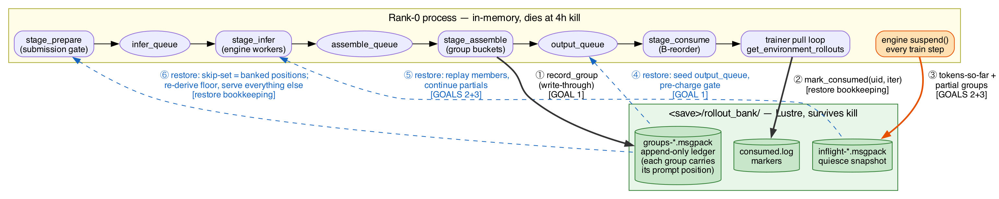
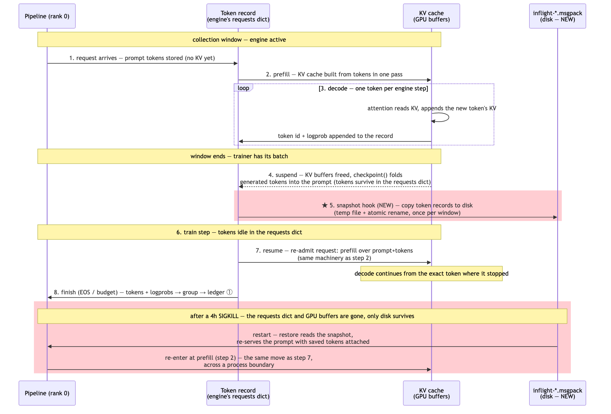
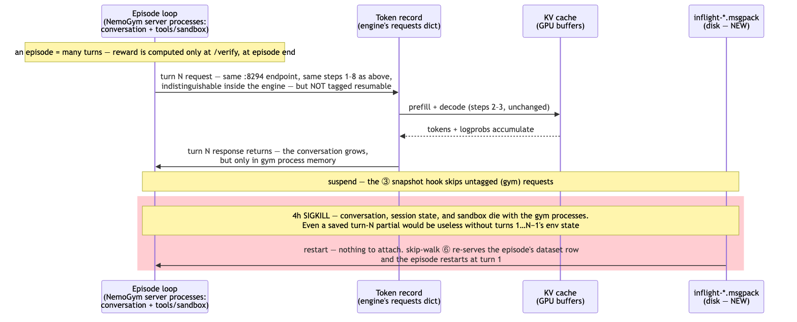
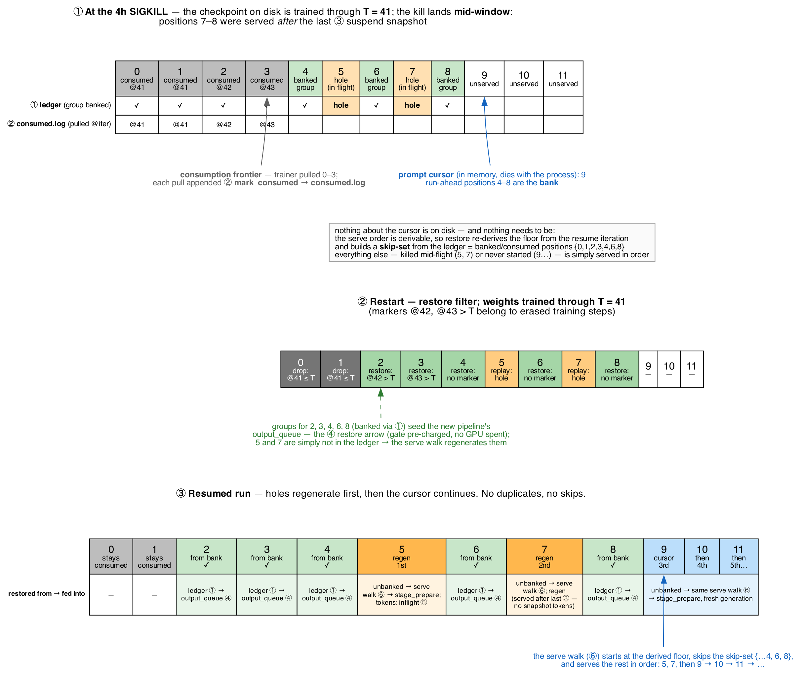

# Durable Rollout Bank: Persisting RL Rollout State Across 4h SLURM Kills

*Author: Laura Dang · July 2026 · Status: Draft for team review*

---

## 1. Background / Goal

### Background

The rollout-granularity work (PRs to Megatron-LM `main`; example run:
[wandb lxi2fprk](https://wandb.ai/adlr/megatron-rl/runs/lxi2fprk?nw=nwuserlaurad))
lets us run GRPO with five submission/consumption settings — B/B, G/G, G/B, R/B,
R/G — instead of only the original B/B. The point of the non-B/B modes is to fill
trainer GPU idle bubbles by generating rollouts ahead of consumption and banking
them in queues, bounded by the `--rl-generation-lag` run-ahead cap. With the recent
consumption-release fix (`0242f8de9`, `9421e8fcd`), the banked backlog is bounded by
gate capacity = `(lag + 1)` batches (`get_rl_parallel_generation_tasks`,
`rollout_granularity.py:11-18`), i.e. `(lag+1) × prompts_per_step × group_size`
rollouts. With the math-env launch config (`nanov3_rl.sh`: 64 prompts, group 16),
a lag-5 run banks up to (5+1) × 64 × 16 = **6,144 rollouts of work** in steady
state.

The problem: our cluster kills every job at the 4h SLURM wall-clock limit, and
**all banked state lives in rank-0 process memory**:

- completed-but-unconsumed rollout groups (`output_queue`, the B-consume reorder
  buffer, the `WeightedMultiTask` round queue),
- partially assembled groups (`assemble_queue`),
- in-flight inference requests (KV cache + tokens generated so far),
- in-flight NemoGym episodes (mid-conversation, mid-tool-call).

On restart, `buffered_rollouts = None` (`megatron/training/training.py:3631`)
forces `get_grpo_data_iterator` to regenerate everything from scratch
(`rl_utils.py:1813-1821`). Every 4h we forfeit exactly the surplus the granularity
modes exist to build — a major reason R/G submission currently loses to B/B in
wall-clock experiments despite better bubble utilization.

### Measured cost of the status quo

Measured on the most recent R-submission runs (2026-07-17 `lagshape_nvls32ap`,
8 nodes / 32 GPUs, 64 prompts × group 16, lag 5, gate = 6,144):
[R/G `bl8qgebf`](https://wandb.ai/adlr/megatron-rl/runs/bl8qgebf) (2 observed
kills) and [R/B `rmunkfhb`](https://wandb.ai/adlr/megatron-rl/runs/rmunkfhb)
(3 observed kills). Method: per-env `*_pipeline_*` queue/gate snapshots at the
last logged step of each SLURM segment (kill boundaries found via `_timestamp`
gaps), cross-checked against cumulative `inferred_count` − `yielded_count`
token flow (agrees within 1–4 points); engine-side split from the
`rl_log_inference_batch_trace` per-rank JSONLs
(`<run_dir>/rl_logging/inference/`), which give active/waiting request counts
and the KV footprint at every suspend boundary.

**Headline: a typical 4h job destroys ~45–60% of every token it generates.**
R/G trains on only 40% of its generated tokens and discards ~60% at the kill
(~134M tokens ≈ 42–64 GPU-h of the 128 GPU-h allocation, per kill); R/B trains
on ~55% and discards ~45% (~124M tokens ≈ 24–36 GPU-h). This tax repeats every
job: each restart rebuilds the queues from zero (the first logged step after a
restart already shows them refilled to ~55–140M tokens), and the next kill
destroys them again.

Where the destroyed work sits, per typical 4h job (averaged over kills; counts
vs tokens diverge because queue composition skews by env trajectory length):

| Where the work died | Recovered by | [R/G](https://wandb.ai/adlr/megatron-rl/runs/bl8qgebf) rollouts (% of lost) | [R/G](https://wandb.ai/adlr/megatron-rl/runs/bl8qgebf) tokens (% of job's gen) | [R/B](https://wandb.ai/adlr/megatron-rl/runs/rmunkfhb) rollouts (% of lost) | [R/B](https://wandb.ai/adlr/megatron-rl/runs/rmunkfhb) tokens (% of job's gen) |
|---|---|---|---|---|---|
| Complete groups in `output_queue` | **Phase A** (ledger ① / seed ④) | 24,272 (72%) | 81.8M (**36.0%**) | 11,696 (52%) | 53.9M (**21.0%**) |
| Complete groups in B-consume reorder buffer | **Phase A** | 0 | 0 | 1,531 (7%) | 10.9M (**4.2%**) |
| Finished members of partial groups (`_assemble_pending`) | **Phase B** (quiesce snapshot ③/⑤) | ~3,164 (9%) | 25.5M (**11.3%**) | ~3,099 (14%) | 33.1M (**13.1%**) |
| Mid-decode in the engine (active; 2,784 = 4 × 696 slot cap) | **Phase C** (token-level resume) | 2,784 (8%) | 26.3M (**11.7%**) | 2,784 (12%) | 26.1M (**10.3%**) |
| In engine waiting queue (submitted, never scheduled) | nothing to recover — skip-walk ⑥ re-serves | 3,355 (10%) | ~0 (**~0%**) | 3,355 (15%) | ~0 (**~0%**) |
| **Total per kill** | | **33,575** | **~134M (~59%)** | **22,464** | **~124M (~48%)** |

Three observations that shaped the phasing:

- **Phases A+B recover 47% (R/G) / 38% (R/B) of each job's entire token
  output** — fully finished work that dies only because nothing persists the
  queues — and it is all plain `RolloutGroup`/`InferenceResponse` data with
  zero engine or NemoGym entanglement. Phase C's harder machinery addresses a
  further 10–12%.
- **Rollout counts and token waste are different measures.** The engine's
  waiting queue is 10–15% of killed rollouts but ~0% of tokens (no GPU work
  done yet); conversely R/G's `output_queue` is 72% of the count but only 36%
  of tokens because it accumulates the cheap short-trajectory envs' readahead,
  while partial groups and in-flight decodes skew toward the expensive envs
  (code_gen, workplace_assistant at ~20–24k tok/rollout).
- **The gym-side split confirms the Phase C boundary.** At every observed
  suspend/kill boundary, active + waiting ≈ the full 6,144 gate population and
  the NemoGym-side count is ~0 — every in-flight rollout holds an open engine
  request, so token-level resume at the engine (plus the §2 non-goal on gym
  episodes) covers the entire in-flight story.

(Measurement caveats: partial groups assume half-filled buckets; engine-active
tokens are the measured KV footprint at kill, ~101–104k blocks × 256, which
includes prompt tokens, so its generated-token share is slightly overstated;
totals differ 1–4 points between snapshot- and flow-based accounting.)

### Goal

Persist banked rollout work across job kills so a restart resumes with the bank
intact, at three levels of ambition:

1. **Completed groups** — never lose a finished-but-unconsumed group.
2. **Finished-but-ungrouped rollouts** — members of partially assembled groups.
3. **Token-level in-flight resume** — continue interrupted generations from their
   tokens-so-far instead of regenerating from token 0.

---

## 2. High-Level Design

### Architecture

The bank is a rank-0 sidecar with two write paths (write-through ledger, per-window
quiesce snapshot) and one read path (restore at startup). Three terms used
throughout:

- A **ledger** is an append-only history: existing entries are never edited or
  deleted, only new ones appended. A kill mid-write can only damage the final
  record (caught by a checksum), and a recorded event can later be "undone" by
  simply ignoring it — which is how consumption rollback works.
- **Write-through** means data hits disk at the same moment it is created in
  memory, so a kill can never take back completed work.
- A **snapshot** is a point-in-time copy that atomically replaces its
  predecessor — used for state that changes too fast to write through, at the
  cost of losing whatever happened after the last copy.



**How to read the diagram.** The yellow box is the rank-0 training process:
everything inside it is Python/GPU memory and vanishes at the 4h kill. The green
box is a directory on Lustre: everything inside it survives. Rectangles are
pipeline stages, ovals are the queues between them, cylinders are files. Rollouts
flow left to right through the pipeline. Solid arrows into the green box are
writes that happen continuously **during the run**; dashed blue arrows out of it
are reads that happen once, **at restart**.

The bracketed tags on the arrows map them to the three goals from §1:
**Goal 1** (completed groups are never lost) is delivered by ① + ④.
**Goals 2 and 3** (finished-but-ungrouped rollouts; token-level resume) are
delivered by ③ + ⑤. ② and ⑥ carry no rollout data themselves — they are the
bookkeeping that makes restore *correct*: no retraining on data the loaded
weights already learned from, no duplicated prompts, no skipped prompts.

Why the ledger doesn't cover Goal 2: ① fires only when a group *completes* —
a finished member of a still-incomplete group exists only in the assemble
stage's in-memory bucket, and it isn't a trainer-ready rollout yet: the reward is
computed by `build_rollout` only once the whole group assembles
(`agent/api.py:427-433`), so at this point the member is a raw
`InferenceResponse` (tokens + logprobs, no reward). Its restore path is also
different — it must be re-matched to a re-served prompt and pushed through
`build_rollout` again, not handed to the trainer directly. So all partial work,
ungrouped members and mid-decode tokens alike, shares one home (the ③ snapshot),
one restore path (⑤), and one loss bound (≤ 1 window).

Step by step:

**During the run — the write paths (solid arrows):**

- **① `record_group` — on every completed group.** The moment `stage_assemble`
  has all G rollouts of a group, it appends the group to the ledger, *before*
  handing it to `output_queue`. Write-through: finished work is on disk the
  instant it exists, so no kill can take it back. (Groups are pydantic models —
  the serialization already exists, `rl_utils.py:696-703`.)

- **② `mark_consumed(uid, iter)` — on every trainer pull.** One line appended to
  `consumed.log`: "group *uid* was used at iteration *iter*". It is a marker, not
  a delete — the group's data stays in the ledger. At restore, markers are
  compared against the checkpoint's **trained-through step T** (the last step
  whose gradient is in the loaded weights): a marker ≤ T is already learned —
  genuinely used up, drop; a marker > T belongs to erased training, so the group
  comes back. Worked example in the bookkeeping section below.

- **③ suspend snapshot — once per collection window.** When generation pauses for
  the train step, the engine suspends and the pipeline freezes. One file is
  rewritten: the in-flight partial generations — tokens-so-far per unfinished
  request. This state changes with every decoded token, far too fast to write
  through, so it is snapshotted at this quiet point instead; a kill mid-window
  loses at most one window of decode progress. Full timeline in "Inside one
  collection window" below.

**At restart — the restore paths (dashed blue arrows):**

- **④ seed `output_queue` — restored groups cost zero generation time.**
  Generating a group is the expensive part: G full trajectories of prefill +
  decode on the inference engine, often minutes of GPU time per group. A banked
  group already contains everything training needs — the finished token
  trajectories, their logprobs, rewards, and staleness epochs — so nothing about
  it needs to be recomputed. The restore filter reads the ledger, keeps every
  group that is still valid (never consumed, or consumed only by rolled-back
  training, and not too stale), and places them directly into the new pipeline's
  `output_queue`, exactly as if they had just been assembled. The trainer's first
  pulls are then satisfied from disk while the GPUs generate only the prompts that
  have no banked group. Without the bank, every one of these groups is regenerated
  from scratch after each 4h kill — that regeneration is precisely the waste this
  design removes. The submission gate is pre-charged to count the restored groups,
  so the run-ahead cap stays enforced.

- **⑤ continuations — interrupted generations resume mid-decode.** When the
  pipeline re-serves a prompt whose generation was cut off, the saved
  tokens-so-far are matched to it and the engine prefills prompt + saved tokens,
  continuing from where the killed run stopped instead of from token 0
  (Phase C; direct-inference agents only). The underlying resume-by-prefill
  mechanism is existing engine code that already fires at every suspend — the
  actual `suspend()`/`checkpoint()` snippets are in §3.6.

- **⑥ re-serve everything unbanked — generation picks up where it left off.**
  Nothing about the prompt cursor is persisted, because nothing needs to be: the
  prompt order is a pure function of the training iteration, so the restarted
  agent re-derives its starting floor, and restore hands it a **skip-set** — the
  positions of every group that came back via ④ (plus those genuinely consumed).
  The agent walks forward from the floor, skipping the skip-set and serving
  everything else in order: positions killed mid-generation and positions never
  started need the identical action — generate — so they don't even have to be
  distinguished. Net effect: no prompt is generated twice, none is skipped, and
  the only inputs are files the bank already has (ledger + markers).

*Diagram source: `rollout_bank_design_assets/bank_architecture.dot`.*

**Why write-through rather than snapshot-on-exit:** a snapshot-only design loses
every group completed during the killed window, and windows are many minutes long
in exactly the long-trajectory regimes this targets — and we cannot rely on any
exit signal at all. The ledger makes completed work durable the moment it exists.
It also covers the reorder buffer and the `WeightedMultiTask` queue *by
construction*: anything banked-at-assembly and not yet marked consumed is
restorable, so no queue introspection is ever needed.

### Inside one collection window: engine lifecycle, the cursor, and the suspend snapshot

The run alternates between collection windows (engine active, trainer pulling
rollouts) and train steps (engine suspended, pipeline frozen). This walks through
one full cycle, step by step, including where the prompt cursor sits and exactly
how it gets saved.

1. **Window opens — the engine resumes.** The trainer reaches rollout collection
   and flips into inference mode; `engine.resume()` is called. Any requests that
   were paused at the previous suspend are re-admitted: their KV cache was dropped
   when the engine suspended, so the engine runs one prefill pass over
   *prompt + tokens-generated-so-far* to rebuild it, then decoding continues from
   the exact token where it stopped. This pause-and-resume-by-prefill machinery
   already exists in the engine today — it is how in-flight generations survive
   the weight update between windows. The bank reuses it across *job restarts*
   instead of just across train steps.

2. **The agent serves prompts — this is where the cursor lives.** As the
   submission gate frees slots, `stage_prepare` asks the agent for the next group.
   The agent holds the env's prompt list in a fixed, reproducible order; it takes
   the position the cursor points at, builds the group's inference request from
   it, and increments the cursor. Note the cursor is pure in-memory bookkeeping:
   it advances *before* the engine is involved, the engine never sees it, and the
   bank never writes it — because the order is derivable, restore can reconstruct
   the serve plan from the ledger alone (step ⑥ in the architecture).

3. **The engine generates.** Each rollout's request goes over the local HTTP
   endpoint into the engine's request queue. The scheduler admits it, runs prefill
   to build KV for the prompt, then the decode loop produces one token per engine
   step for every active request, appending tokens and logprobs and stamping each
   span with the policy epoch (for staleness accounting). Requests finish by EOS
   or length limit, and their responses flow back to the awaiting pipeline
   coroutines.

4. **Groups assemble and are banked (①).** `stage_assemble` buckets finished
   rollouts by group; the moment a group is complete, it is appended to the ledger
   and only then pushed to `output_queue`.

5. **The trainer pulls; markers append (②).** The trainer takes its
   `n_prompts` groups, appending a `mark_consumed` line per pull. Generation for
   future batches keeps running concurrently the whole time — that concurrency is
   the run-ahead the granularity modes exist for.

6. **Window closes — the engine suspends.** Once the trainer has its batch,
   `engine.suspend()` halts the decode loop. Every unfinished request is reduced
   to a compact record — prompt tokens, tokens generated so far, their logprobs,
   epoch spans, and the remaining token budget — and its KV blocks are freed.
   (This is the same record type from step 1; nothing here is new engine
   machinery.) On the client side, the asyncio event loop stops spinning, so every
   queue and half-built group in the pipeline freezes in place.

7. **The suspend hook writes the snapshot (③) — this is the new code.** With
   everything frozen, rank 0: (a) asks the engine for its request records and
   writes them to `inflight-<iter>.msgpack`; (b) fsyncs the ledger segment and
   `consumed.log`. The snapshot file is written to a temp name and atomically
   renamed over the previous window's file, so a kill at any instant — even
   mid-write — leaves the previous window's snapshot intact and readable.

8. **The train step runs**, then the loop returns to step 1.

**Why the cursor is never saved.** The serve order is a pure function of the
training iteration (floor = `iteration × prompts_per_iter`, then sequential), so
restore doesn't need any record of where the cursor stood: it re-derives the
floor for the resume step, builds a **skip-set** from the ledger (every position
with a valid banked group, plus positions whose consumption survives the
rollback rule), and the agent simply walks forward serving everything not in the
skip-set. A position killed mid-generation and a position never started need the
identical action — generate — so restore never has to tell them apart.

**What a mid-window kill actually loses.** Only the tokens decoded since the last
suspend for requests that were still in flight — at most one window of decode
progress. It does not lose completed groups (write-through ledger, step 4) and
does not lose consumption history (markers, step 5). The unbanked positions are
simply (re-)served by the skip-walk — and where the previous suspend's snapshot
has their partial tokens, Phase C continues them instead of starting over.

### The life of one in-flight request: tokens vs. KV cache

The window walkthrough above treats "③ tokens-so-far" as a single arrow; this
section zooms into one generation request to show why saving tokens — and never
the KV cache — is enough. The principle: **tokens are the source of truth, and
the KV cache is exactly what its name says — a cache**, derived data computed
from tokens + weights, rebuildable by prefill whenever needed. KV blocks are
gigabytes and specific to the GPU layout; token records are kilobytes — plain
Python dataclasses of token ids, logprobs, and sampling params, held in the
engine's `requests` dictionary (`dynamic_engine.py:316`).



*Each lifeline is a place state lives: the pipeline, the token record in the
engine's `requests` dict, the KV cache in GPU buffers, and the snapshot file on
disk. Everything
unshaded is existing machinery that runs today, every training step. The two
red-shaded bands are what this design adds in Phase C: the ★ step-5 snapshot
write, and the restore path after a kill. Diagram source:
`rollout_bank_design_assets/bank_request_lifecycle.mmd`.*

1. **Request arrives — tokens only.** The prompt is tokenized into
   `prompt_tokens`, a small integer array stored in the request's entry in the
   engine's `requests` dict. No KV exists yet.

2. **Prefill — the KV cache is built.** The scheduler admits the request and the
   model runs one forward pass over all prompt tokens at once. For every token at
   every layer, the attention Key/Value vectors are computed and stored in the
   GPU KV buffers. The KV cache exists purely so decoding doesn't have to re-run
   attention over the whole prefix for each new token — it is a recomputable
   function of (tokens, weights), nothing more.

3. **Decode — both representations grow in lockstep.** Each engine step produces
   one new token per active request: the forward pass reads the KV cache, a token
   is sampled, its KV vectors are appended to the GPU cache, **and** the token id
   + logprob are appended to `generated_tokens` in the request record. At every
   moment, the request record holds the complete history of the generation; the
   KV cache holds the same information in its expensive GPU form.

4. **Window ends — suspend: KV discarded, tokens kept.** The trainer has its
   batch; `suspend()` deallocates the KV buffers to free the GPUs for training,
   and `record.checkpoint()` rewrites each unfinished request's record as
   *new prompt = original prompt + tokens generated so far*, with the remaining
   token budget. From this instant, the record in the `requests` dict is the
   **only** surviving representation of the generation.

5. **★ The suspend hook saves tokens to disk — this is Phase C's new step.**
   Immediately after suspend, the snapshot hook copies the token records out of
   the `requests` dict into `inflight-<iter>.msgpack` on Lustre (write temp
   file, atomic rename).
   This is the one and only point in the whole cycle where tokens touch disk —
   once per window, at the natural pause, never in the decode hot path.

6. **Train step runs.** The token records sit untouched in the `requests`
   dict. *Today*, a kill
   here (or anywhere) destroys them with the process. *With Phase C*, the disk
   copy from step 5 survives; at most the tokens decoded since the last step-5
   snapshot are lost.

7. **Next window — resume: KV rebuilt from tokens.** `resume()` reallocates GPU
   buffers and re-admits each checkpointed request. Because its "prompt" is now
   the full prefix (original prompt + generated tokens), the ordinary prefill of
   step 2 rebuilds the entire KV cache in one pass, and decode (step 3) continues
   from exactly the token where it stopped. Note this is the same step-2
   machinery — resume is just prefill over a longer prompt.

8. **Request finishes.** On EOS or budget exhaustion, the response (tokens +
   logprobs) leaves the engine for the pipeline, is assembled into its group, and
   is banked by the ledger (①). The engine record is dropped and its KV freed.

**After a job kill + restart (Phase C's payoff):** the restore path reads the
step-5 file; when the resumed pipeline re-serves the same prompt, the saved
tokens are attached and submitted as *prompt = original prompt + saved tokens* —
entering the lifecycle at step 2, exactly like step 7, just across a process
boundary instead of a train step. The KV cache is never missed, because it was
never the source of truth — every KV cache this request will ever have is built
from its tokens.

**The NemoGym variant — same engine lifecycle, different fate.** A NemoGym
*turn* goes through steps 1–8 above unchanged: the gym's policy model posts to
the same `:8294` endpoint, and inside the engine its request is indistinguishable
from a math rollout (both reduce to `add_request(prompt_tokens,
sampling_params)` — the choke-point proof in §3.6). What differs is the thing
*wrapping* the request. For a direct-inference rollout, the request **is** the
unit of value: save its tokens and you can finish it. For a gym episode, one
request is only turn N of a conversation whose real state — the message history,
the session, the tool sandbox — lives in the gym server processes, outside the
diagram's yellow box entirely, and the reward exists only at `/verify` after the
final turn:



*The turn's engine lifecycle is steps 1–8 unchanged; gym requests are simply not
tagged `resumable`, so the ③ snapshot skips them. At the kill, the conversation
and sandbox die with the gym processes — a saved turn-N partial would be useless
without turns 1…N−1's env state — so the skip-walk ⑥ re-serves the episode's
dataset row and it restarts at turn 1. Nothing partial had training value:
reward is computed only at episode end. Diagram source:
`rollout_bank_design_assets/bank_request_lifecycle_gym.mmd`.*

### Bookkeeping: consumption markers and the prompt cursor

The bank's data files answer "what work exists?"; two small bookkeeping streams
answer the harder question after a restart: **"which of it is still useful, and
where do we pick up generating?"** They track two independent pointers over the
env's deterministic prompt order:

- **The consumption frontier** — how far the *trainer* has gotten; in the
  architecture diagram this is the ② arrow into `consumed.log`. Every time the
  trainer pulls a group, `mark_consumed(group_uid, curr_iteration)` is appended.
  Crucially this is a **marker, not a deletion**: the group's data stays in the
  ledger. That matters because training itself can roll back — a restart resumes
  from the last *model* checkpoint, which erases every step the killed run took
  after the checkpoint's **trained-through step T**: the last step whose gradient
  the loaded weights actually contain. All rules in this doc use T so they read
  the intuitive way — *marker ≤ T = trained; marker > T = not trained*. (One
  conversion note: Megatron's on-disk checkpoint label is T + 1, because it
  stores "resume at this step" — the counter increments after each train step and
  is saved then, `training.py:3718/3818`. The bank computes T = stored label − 1
  once at load.) Because the marker records *which iteration* consumed the group,
  the restore filter can distinguish "consumed by training the checkpoint
  contains" (marker ≤ T → genuinely used up, drop) from "consumed by training
  that no longer exists" (marker > T → effectively never consumed, restore). A
  delete could not be undone; a marker can be ignored.
- **The prompt cursor** — how far *generation* has gotten. Each env serves
  prompts in a reproducible order (the NemoGym curriculum derives it from the
  training iteration), and `stage_prepare` walks that order ahead of the
  trainer — that run-ahead gap between the two pointers **is the bank**.
  Crucially, the cursor is **never persisted, because it is derivable**: each
  banked group carries its position, so at restart the agent re-derives its
  starting floor from the resume iteration and walks forward, skipping every
  position in the **skip-set** (banked or genuinely-consumed positions, straight
  from the ledger + markers) and serving everything else in order. A position
  whose rollouts were mid-flight at the kill (a **hole**) and a position never
  started need the identical action — generate — so restore doesn't distinguish
  them. No prompt is generated twice, none is skipped, and no cursor file exists.

**What the cursor actually is, with real data.** An env's dataset is a JSONL
file — one prompt per line, loaded at startup into a Python list
(`nemo_gym_agent.py:356-365`). The cursor is a single integer attribute,
`self._curriculum_cursor` (`nemo_gym_agent.py:425`): **a line number into that
file**, pointing at the next prompt nobody has started yet. Serving a prompt is
literally `self.dataset[idx % len(self.dataset)]` followed by `cursor += 1`
(`:448-451`). Worked numbers with the math config (64 prompts/step): at training
iteration 42 the curriculum floor is 42 × 64 = 2688 (`_next_curriculum_index`
clamps the cursor to at least `iteration × prompts_per_iter`, `:117-119`). The
trainer's batch consumes rows 2688–2751; run-ahead keeps serving 2752, 2753, …
If the job dies with cursor = 2755, then rows 2688–2754 were each handed out
(one row per *group* — all 16 rollouts of a group sample the same row) and line
2755 is the next to serve:

```text
calendar_prompts.jsonl                              at the kill: cursor = 2755
──────────────────────────────────────────────────────────────────────────────
2752  {"responses_create_params": {"input": ["Schedule a 30-min sync…"]}}    served → group banked
2753  {"responses_create_params": {"input": ["Find a slot for Alice…"]}}     served → group banked
2754  {"responses_create_params": {"input": ["Reschedule the standup…"]}}    served → in flight at kill
2755  {"responses_create_params": {"input": ["Plan a recurring 1:1…"]}}    ← cursor: next line to serve
2756  {"responses_create_params": {"input": ["Move Friday's review…"]}}      unserved

after restart (nothing about the cursor was saved):
  floor  = re-derived from resume iteration = 2688
  skip-set = banked/consumed positions from the ledger = {2688 … 2753}
  serve walk: 2754 first (unbanked), then 2755, 2756, …
```

The in-memory cursor integer dies with the process — and that's fine. The
restart re-derives the floor (2688) and skips everything the ledger already
accounts for, so it re-serves only 2754 (whose work was genuinely lost) and then
continues exactly where the killed run would have. Without the skip-set, the
restart would regenerate rows 2688–2753 — duplicates of groups already banked;
the skip-set, not a cursor file, is what prevents that.

The worked example below shows both pointers across a kill and restart. Each row
is the same twelve prompt positions of one env, at three moments in time:



Walking through it panel by panel:

- **Panel ① — the moment of the kill.** The trainer had pulled positions 0–3, so
  each of them has a consumption marker recording the iteration that used it
  (@41, @41, @42, @43); the gray *consumption frontier* sits after position 3.
  Generation had run ahead of the trainer: groups for 4, 6, and 8 finished and
  were banked (green), while 5 and 7 were still mid-generation (orange "holes").
  The blue *prompt cursor* stands at 9 — the next position `stage_prepare`
  would have served. Everything between the two pointers is the run-ahead gap the
  bank exists to preserve. The two rows beneath the tape are the bank files
  themselves: **① the ledger** holds the banked groups, and **② consumed.log**
  holds the pull markers with their iterations. Every position moves one-way
  through **served → ① banked → ② consumed** (a group must finish assembling
  before it can be banked, and must be banked before the trainer can consume
  it — and consumption only adds a marker, never removes the ledger entry).
  Reading a column top-down tells you how far that position got before the kill:
  ①+② = consumed, ① only = banked run-ahead, neither = either mid-generation
  when the job died (a **hole** — its work was lost) or never started; restore
  treats those two identically, so it never needs to tell them apart. Note the
  job dies while training step 44, but the loaded weights will contain training
  only through step 41 — the checkpoint's trained-through step **T = 41**. The
  callout beneath the tape shows the cursor story: nothing about it is on disk,
  and nothing needs to be — the floor is re-derived from the resume iteration
  and the banked positions come from the ledger. One nuance: the kill lands
  mid-window, after 7–8 were served. Position 8's group still banked (the ledger
  is write-through), but position 7's partial tokens are *not* in the in-flight
  snapshot, since it started after the last suspend — that lost decode progress
  is exactly the "at most one window" bound.

- **Panel ② — the restore filter at restart.** The weights are trained through
  T = 41, so steps 42–44 never happened as far as they are concerned — and the
  resumed run's first executed step *is* 42, which needs its data back. The
  filter walks the ledger and decides per position: 0 and 1 stay consumed
  (markers @41 ≤ T — that learning is inside the loaded weights); 2 and 3 are
  **restored even though they were consumed** (markers @42, @43 > T — the steps
  that consumed them were erased; this is why consumption is a marker rather
  than a deletion); 4, 6, 8 are restored as never-consumed; 5 and 7 are simply
  not in the ledger, so the serve walk will regenerate them. The five restored
  groups seed the new pipeline's `output_queue` directly — no GPU time is spent
  on them.

- **Panel ③ — the resumed run.** The trainer's first pulls are served straight
  from the bank (positions 2, 3, 4, 6, 8). Generation restarts with the two holes
  first (5, then 7), then the serve walk reaches the fresh positions and
  advances 9 → 10 → 11 as normal. The bottom row spells out each column's source and destination:
  banked groups are read from the **ledger (①)** and seeded directly into
  **`output_queue` (④)** — the trainer pulls them without touching the GPU;
  unbanked positions are re-served through **`stage_prepare`** by the skip-walk
  (⑥) — position 5's partial tokens continue from the **in-flight snapshot (⑤)**
  under Phase C, while position 7 regenerates from scratch (it started after the
  last suspend, so no snapshot has its tokens — the one-window loss bound in
  action); fresh positions follow in the same walk.
  Comparing panel ③ against panel ①: every position is accounted for exactly
  once — nothing was generated twice, nothing was skipped.

*Diagram source: `rollout_bank_design_assets/bank_cursor_tape.dot`.*

Component-level details: the restore filter's full rule set is §3.2; the
skip-walk hook in the NemoGym agent is §3.4.

### End-to-end: the bank files across one kill

Toy config so everything fits on screen: 2 prompts/step, group size 2, lag 1.
Iteration *i* owns dataset rows 2·*i* and 2·*i*+1; run-ahead may serve two more.

```text
── iteration 10's collection window ──────────────────────────────────────────
served rows 20,21,22,23 · groups 20,21,22 assembled · trainer pulled 20,21
· group 23 still decoding at window end

gen-10/groups-000.msgpack   {uid:g20, pos:20, gen_iter:10, rollouts:[tokens, logprobs, reward]}
                            {uid:g21, pos:21, …}   {uid:g22, pos:22, …}      ← ① at assembly
gen-10/consumed.log         {uid:g20, iter:10}  {uid:g21, iter:10}           ← ② at each pull
gen-10/inflight-10.msgpack  {hash(row23): tokens-so-far + logprobs}          ← ③ at suspend

── end of step 10: model checkpoint saved → trained through T = 10 ───────────

── iteration 11's window, then SIGKILL mid-train-step ────────────────────────
group 23 finished → banked · served 24,25 · group 24 banked · trainer
pulled 22,23 · group 25 still decoding

ledger      += {uid:g23, …}  {uid:g24, …}
consumed.log+= {uid:g22, iter:11}  {uid:g23, iter:11}
inflight-11.msgpack          {hash(row25): tokens-so-far}
                              ✂ SIGKILL — every queue and record in memory is
                                gone; the files above survive on Lustre

── restart: checkpoint trained through T = 10, restore filter runs ───────────
g20, g21   marker @10 ≤ T    → dropped   (that training is in the loaded weights)
g22, g23   marker @11 > T    → RESTORED  (their training steps were erased)
g24        no marker         → RESTORED
serve walk: floor re-derived from resume step (row 22), skip-set from the
           ledger = {22,23,24} → first unbanked row is 25, re-served first
           (Phase C: decode continues from inflight-11's tokens), then 26, 27, …
```

Net effect: the resumed trainer's first pulls are g22, g23, g24 straight from
disk (zero GPU time), row 25 resumes mid-generation instead of restarting, and
generation picks up at row 26 — no duplicates, no skips, nothing finished is
lost. Compaction then rewrites the survivors into a fresh `gen-11/` directory
and atomically flips `MANIFEST.json`.

### What survives a kill

| State domain | Mechanism | Loss bound after SIGKILL |
|---|---|---|
| Completed, unconsumed groups | write-through ledger | **zero** |
| Groups consumed by rolled-back steps | consumption markers + rollback rule | **zero** (restored) |
| Finished members of partial groups | quiesce snapshot | ≤ 1 window |
| Engine in-flight generations | quiesce snapshot (tokens-so-far) | ≤ 1 window of decode |
| NemoGym mid-episode state | **out of scope** (see below) | episode restarts |
| KV cache | never persisted; recomputed by prefill | n/a |

### Explicit non-goals

- **NemoGym mid-episode resume.** A live episode's state spans three-plus
  processes: the conversation list is coroutine-local inside the NemoGym agent
  server, environment state is session-cookie-keyed in the resources server, and
  SWE tasks hold a mutated Apptainer sandbox on a Ray worker. Reward is computed
  only at episode end (`/verify`), so an interrupted episode has no trainable
  tokens or reward on the Megatron side. In-flight episodes always restart from
  scratch; **completed** episodes are ordinary banked groups and get full Phase A
  benefit, and the skip-walk (⑥) guarantees restarted episodes neither duplicate
  nor skip prompts.
- **Token-identical replay.** Continuations resume with a fresh sampling RNG; they
  are statistically valid samples with per-token-correct logprobs and staleness
  epochs, not reproductions of the killed run.

---

---

*Sections 3 (Components) and 4 (Code-Level Changes) to follow in a subsequent revision.*
